# Question Management Feature Documentation

## Overview
Question management system for defense sessions with duplicate detection using hybrid fuzzy + semantic similarity matching. All data stored in **Redis cache only** (no database persistence). Combines RapidFuzz (character-level) with SBERT (meaning-level) for robust duplicate detection.

**Endpoints**: 
- `POST /questions/check-duplicate` - Check only (no registration)
- `POST /questions/register` - Register only (no duplicate check)
- `POST /questions/check-and-register` - Check + auto-register if unique (**recommended**)
- `GET /questions/{session_id}` - List all questions in session
- `DELETE /questions/{session_id}` - Clear all questions in session

---

## Class Specification

> Architecture Note: Controllers depend on `IQuestionService` and the service depends on `IRedisService`. The duplicate detection logic is abstracted behind interfaces for testability.

### Table 1.1: QuestionRouter (Question Management Controller) Description Table

import mic from 'mic';
import fs from 'fs';

const micInstance = mic({
  rate: '16000',
  channels: '1',
  bitwidth: '16',
  encoding: 'signed-integer',
  endian: 'little'
});

const micInputStream = micInstance.getAudioStream();
const outputFileStream = fs.WriteStream('recording.raw');

micInputStream.pipe(outputFileStream);

micInstance.start();

setTimeout(() => {
  micInstance.stop();
  // Gửi recording.raw lên server
}, 10000); // Thu 10 giây| No | Method | Description |
|----|--------|-------------|
| 1  | check_duplicate(request: QuestionCheckRequest, question_service: IQuestionService) → QuestionCheckResponse | `POST /questions/check-duplicate` - This endpoint checks for duplicate questions using hybrid fuzzy and semantic matching, returning similar questions without registering the new question. |
| 2  | register_question(request: QuestionRegisterRequest, question_service: IQuestionService) → QuestionRegisterResponse | `POST /questions/register` - This endpoint registers a question to Redis cache without duplicate checking (blind insert) and auto-generates speaker name and timestamp. |
| 3  | check_and_register(request: QuestionRegisterRequest, question_service: IQuestionService) → QuestionCheckResponse | `POST /questions/check-and-register` - **Recommended endpoint**. This method checks for duplicates and auto-registers the question if unique (threshold 0.85). |
| 4  | list_questions(session_id: str, question_service: IQuestionService) → QuestionListResponse | `GET /questions/{session_id}` - This endpoint retrieves all questions for the specified session from Redis cache. |
| 5  | clear_questions(session_id: str, question_service: IQuestionService) → ClearQuestionsResponse | `DELETE /questions/{session_id}` - This endpoint deletes all questions for the specified session from Redis cache. |

### Table 1.2: QuestionService (Question Management Logic) Description Table

| No | Method | Description |
|----|--------|-------------|
| 1  | check_duplicate(session_id: str, question_text: str, threshold: float = 0.85, semantic_threshold: float = 0.85) → Tuple[bool, List[Dict]] | This method performs hybrid duplicate detection using RapidFuzz (weighted 60/30/10) and SBERT cosine similarity, returning an is_duplicate flag and sorted list of similar questions. |
| 2  | register_question(session_id: str, question_text: str, speaker: str, timestamp: str) → Dict[str, Any] | This method appends the question to Redis list with auto-incremented ID and TTL of 7200 seconds, returning success status, question_id, and total_questions count. |
| 3  | get_questions(session_id: str) → List[str] | This method retrieves the question text list from Redis with metadata stripped, returning an empty list if not found. |
| 4  | clear_questions(session_id: str) → int | This method deletes the Redis cache key and returns the count of deleted questions. |
| 5  | _get_session_key(session_id: str) → str | This helper method returns the Redis key in format `questions:session:{session_id}`. |
| 6  | _normalize_text(text: str) → str | This method normalizes text by converting to lowercase, stripping whitespace, removing punctuation, and collapsing spaces (e.g., "Em Hỏi  Về   API!!" → "em hoi ve api"). |
| 7  | _calculate_similarity(text1: str, text2: str) → float | This method calculates weighted fuzzy score combining simple_ratio (60%), token_sort_ratio (30%), and token_set_ratio (10%), returning a value between 0.0 and 1.0. |

---

## Sequence Diagram


---

## Class Diagram

```mermaid
classDiagram
    class QuestionRouter {
        <<controller>>
        -question_service : IQuestionService
        +check_duplicate(request: QuestionCheckRequest) QuestionCheckResponse
        +register_question(request: QuestionRegisterRequest) QuestionRegisterResponse
        +check_and_register(request: QuestionRegisterRequest) QuestionCheckResponse
        +list_questions(session_id: str) QuestionListResponse
        +clear_questions(session_id: str) ClearQuestionsResponse
    }

    class IQuestionService {
        <<interface>>
        +check_duplicate(session_id: str, question_text: str, threshold: float, semantic_threshold: float) Tuple
        +register_question(session_id: str, question_text: str, speaker: str, timestamp: str) Dict
        +get_questions(session_id: str) List
        +clear_questions(session_id: str) int
    }

    class QuestionService {
        -session_ttl : int
        -_redis_service : IRedisService
        -_semantic_model : SentenceTransformer
        +check_duplicate(session_id, question_text, threshold, semantic_threshold) Tuple
        +register_question(session_id, question_text, speaker, timestamp) Dict
        +get_questions(session_id) List
        +clear_questions(session_id) int
        -_get_session_key(session_id: str) str
        -_normalize_text(text: str) str
        -_calculate_similarity(text1: str, text2: str) float
    }

    class IRedisService {
        <<interface>>
        +get(key: str) Any
        +set(key: str, value: Any, ttl: int) bool
        +delete(key: str) int
    }

    class SentenceTransformer {
        <<external>>
        +encode(text: str, convert_to_tensor: bool) Tensor
    }

    class RapidFuzzModule {
        <<module>>
        +fuzz.ratio(text1: str, text2: str)$ int
        +fuzz.token_sort_ratio(text1, text2)$ int
        +fuzz.token_set_ratio(text1, text2)$ int
    }

    class QuestionCheckRequest {
        <<dataclass>>
        +session_id: str
        +question_text: str
    }

    class QuestionRegisterRequest {
        <<dataclass>>
        +session_id: str
        +question_text: str
    }

    class QuestionCheckResponse {
        <<dataclass>>
        +is_duplicate: bool
        +question_text: str
        +similar_questions: List~SimilarQuestion~
        +message: str
    }

    class QuestionRegisterResponse {
        <<dataclass>>
        +success: bool
        +question_id: int
        +total_questions: int
        +message: str
    }

    class QuestionListResponse {
        <<dataclass>>
        +session_id: str
        +questions: List~str~
        +total: int
    }

    class ClearQuestionsResponse {
        <<dataclass>>
        +success: bool
        +session_id: str
        +deleted: int
        +message: str
    }

    class SimilarQuestion {
        <<dataclass>>
        +text: str
        +score: float
        +fuzzy_score: Optional~float~
        +semantic_score: Optional~float~
    }

    QuestionRouter ..> IQuestionService : «use»
    QuestionService ..|> IQuestionService
    QuestionService ..> IRedisService : «use»
    QuestionService ..> SentenceTransformer : «use»
    QuestionService ..> RapidFuzzModule : «use»
    QuestionCheckResponse "1" *-- "*" SimilarQuestion : contains
    QuestionRouter ..> QuestionCheckRequest : «use»
    QuestionRouter ..> QuestionRegisterRequest : «use»
    QuestionRouter ..> QuestionCheckResponse : «create»
    QuestionRouter ..> QuestionRegisterResponse : «create»
    QuestionRouter ..> QuestionListResponse : «create»
    QuestionRouter ..> ClearQuestionsResponse : «create»
```



---

## Key Features

### Hybrid Duplicate Detection Logic

Question is **duplicate** if **ANY** of these 3 paths is true:

**Path 1: Both Fuzzy and Semantic Reasonably High**
```python
(fuzzy_score >= 0.85) AND (semantic_score >= 0.70)
```
- Example: "Em hỏi về kiến trúc hệ thống" vs "Hỏi về kiến trúc"
- fuzzy = 0.87, semantic = 0.91 → ✅ Duplicate

**Path 2: Nearly Identical Text**
```python
fuzzy_score >= 0.95
```
- Example: "API layer là gì" vs "API layer là gì?"
- fuzzy = 0.98 → ✅ Duplicate (even if semantic is low due to short text)

**Path 3: Similar Meaning**
```python
semantic_score >= 0.85
```
- Example: "Giải thích về API layer" vs "API layer dùng để làm gì?"
- semantic = 0.87 → ✅ Duplicate (even if fuzzy is low due to different wording)

**Note**: Default thresholds are 0.85 for both fuzzy and semantic, but Path 1 uses 0.70 semantic threshold for flexibility

**Rationale**: Hybrid approach catches both:
- **Paraphrases** (same words, different order) → fuzzy high
- **Synonyms** (different words, same meaning) → semantic high

---

### Fuzzy Matching (RapidFuzz)

**Weighted Average Formula**:
```python
fuzzy_score = (simple_ratio * 0.6) + (token_sort_ratio * 0.3) + (token_set_ratio * 0.1)
```

**Components**:

| Algorithm | Weight | Purpose | Example |
|-----------|--------|---------|---------|
| **simple_ratio** | 60% | Levenshtein distance (character-level) | "xin chào" vs "xìn chào" → 89 (tone difference) |
| **token_sort_ratio** | 30% | Sorted tokens (order-independent) | "API layer là gì" vs "Là gì API layer" → 100 (perfect) |
| **token_set_ratio** | 10% | Set-based (handles extra/missing words) | "Em hỏi về API" vs "Hỏi về API layer" → 88 (extra "layer") |

**Examples**:

| Text 1 | Text 2 | Simple | Token Sort | Token Set | Weighted | Match? |
|--------|--------|--------|------------|-----------|----------|--------|
| "xin chào" | "xìn chào" | 89 | 89 | 100 | 0.891 | ✅ (Path 1 if semantic >= 0.70) |
| "API layer là gì" | "Là gì API layer" | 76 | 100 | 100 | 0.832 | ⚠️ (Depends on semantic) |
| "Em hỏi về API" | "Hỏi về API layer" | 82 | 88 | 100 | 0.852 | ✅ (Path 1 if semantic >= 0.70) |

---

### Semantic Matching (SBERT)

**Model**: `paraphrase-MiniLM-L6-v2` (SentenceTransformers)
- **Embedding dimension**: 384
- **Similarity metric**: Cosine similarity (range: -1 to 1, typically 0.5-1.0 for related texts)
- **Loading**: Lazy load on first `check_duplicate()` call (~150MB download)

**Examples**:

| Text 1 | Text 2 | Cosine | Match? |
|--------|--------|--------|--------|
| "Kiến trúc hệ thống là gì?" | "Hệ thống được thiết kế như thế nào?" | 0.82 | ❌ (< 0.85) |
| "Giải thích về API layer" | "API layer dùng để làm gì?" | 0.87 | ✅ (Path 3) |
| "Three layer architecture" | "Kiến trúc 3 lớp" | 0.91 | ✅ (Cross-language similarity) |

**Performance**: 
- **First call**: ~500ms (model download + load)
- **Subsequent calls**: ~50-100ms per comparison (CPU), ~10-20ms (GPU)

---

### Text Normalization Pipeline

**Steps**:
1. **Lowercase**: `"Em Hỏi Về API"` → `"em hỏi về api"`
2. **Strip whitespace**: `"  text  "` → `"text"`
3. **Remove punctuation**: `"là gì?"` → `"là gì"`
4. **Collapse spaces**: `"em  hỏi   về"` → `"em hỏi về"`

**Example**:
```python
Input:  "Em Hỏi  Về   Kiến Trúc!!"
Output: "em hoi ve kien truc"  # Note: Vietnamese tones removed by lowercase
```

---

### Response Examples

**Check Only - Duplicate Found**:
```json
{
  "is_duplicate": true,
  "question_text": "Em hỏi về kiến trúc hệ thống",
  "similar_questions": [
    {
      "text": "Hỏi về kiến trúc",
      "score": 0.91,
      "fuzzy_score": 0.868,
      "semantic_score": 0.91
    }
  ],
  "message": "⚠️ Câu hỏi trùng lặp! Tìm thấy 1 câu tương tự."
}
```

**Check and Register - Success (Unique)**:
```json
{
  "is_duplicate": false,
  "question_text": "Em hỏi về kiến trúc hệ thống",
  "similar_questions": [],
  "message": "✅ Câu hỏi đã được lưu. Tổng: 3"
}
```

**Register Only - Success**:
```json
{
  "success": true,
  "question_id": 4,
  "total_questions": 4,
  "message": "✅ Câu hỏi đã được lưu. Tổng: 4"
}
```

**List Questions**:
```json
{
  "session_id": "SES001",
  "questions": [
    "Hỏi về kiến trúc",
    "API layer là gì",
    "Em hỏi về kiến trúc hệ thống"
  ],
  "total": 3
}
```

**Clear Questions**:
```json
{
  "success": true,
  "session_id": "SES001",
  "deleted": 3,
  "message": "Đã xóa 3 câu hỏi"
}
```

---

### Session Management (Redis Cache Only)

**Storage**: Redis cache (key-value store) - **No database persistence**

**Key Format**: `questions:session:{session_id}`

**Value**: JSON array of question objects
```json
[
  {
    "text": "Em hỏi về kiến trúc hệ thống",
    "speaker": "Khách",
    "timestamp": "2025-11-24T10:30:00Z",
    "id": 1
  },
  {
    "text": "API layer là gì",
    "speaker": "Khách",
    "timestamp": "2025-11-24T10:32:15Z",
    "id": 2
  }
]
```

**TTL**: 7200 seconds (2 hours)
- Auto-expires after session ends
- Timer resets on each new question registration
- Can be manually cleared via `DELETE /questions/{session_id}`

**Isolation**: Questions scoped by `session_id` (no cross-contamination between sessions)

**Data Lifecycle**:
```
1. First question → Create Redis key with TTL 7200s
2. Questions accumulate (max 2 hours)
3. Either:
   a) Manual clear: DELETE /questions/{session_id}
   b) Auto-expire: TTL reaches 0 (data lost)
4. Session cleaned up (no persistence)
```

---

### Performance Characteristics

**Latency** (per comparison):
- **Fuzzy matching**: ~0.5ms (RapidFuzz C++ backend)
- **Semantic matching**: ~50ms CPU / ~10ms GPU (SBERT)
- **Total**: ~100-300ms for checking against 10 existing questions

**Memory**:
- **SBERT model**: ~150MB (lazy loaded, shared across sessions)
- **Question cache**: ~1KB per question (text + metadata)
- **Redis overhead**: ~50 bytes per key
- **Comparison complexity**: O(N) where N = existing questions count

**Scalability**:
- **Max questions per session**: No hard limit (unlimited storage until Redis memory full or TTL expires)
- **Practical recommendation**: ~50-100 questions per session for optimal performance
- **Concurrent sessions**: Unlimited (Redis cache isolation)
- **No database**: All data volatile, lost after TTL expiry

---

### Edge Cases

**Empty Session**:
- First question → Auto-register without comparison
- `is_duplicate=False`, `similar_questions=[]`

**Expired Session**:
- Redis TTL expired (> 2 hours) → Same as empty session
- No error, just treats as new session

**SBERT Model Load Failure**:
- Falls back to fuzzy-only matching
- `semantic_score=0` for all comparisons
- Still works but less accurate for paraphrases

---

**Last Updated**: November 24, 2025  
**Version**: 1.0
