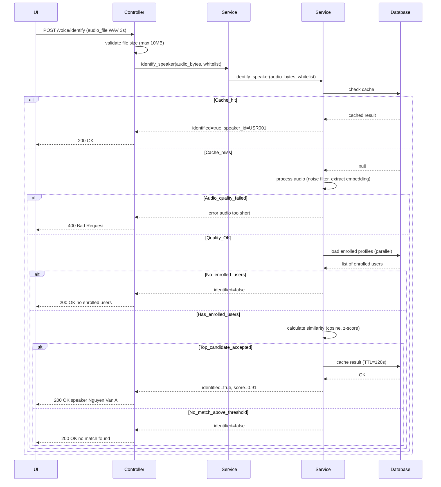
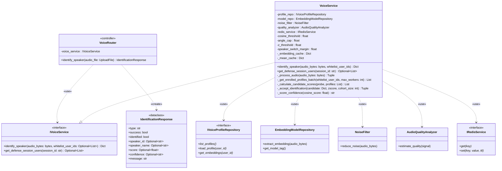

# Speaker Identification Feature Documentation

## Overview
Speaker identification (1:N matching) identifies an unknown speaker from audio by comparing against all enrolled users. Uses cosine similarity with z-score cohort analysis for robust matching.

**Endpoint**: `POST /voice/identify`  
**Input**: Audio file (WAV/PCM, minimum 2 seconds)  
**Output**: Best matching speaker above threshold or "unknown"

---

## Class Specification

> Architecture Note: This feature now uses interfaces (IVoiceService, IVoiceProfileRepository, IRedisService). Controllers depend on `IVoiceService` resolved via dependency injection. Caches and storage are accessed only through repository interfaces to maintain DIP compliance.

### Table 2.1: VoiceRouter (Speaker Identification Controller) Description Table

| No | Method | Description |
|----|--------|-------------|
| 1  | identify_speaker(audio_file: UploadFile, voice_service: IVoiceService) → IdentificationResponse | `POST /voice/identify` - This endpoint validates the uploaded file (max 10MB) and calls IVoiceService.identify_speaker(), returning identification status, speaker_id, score, and confidence level. |

### Table 2.2: VoiceService (IVoiceService Implementation) Description Table

| No | Method | Description |
|----|--------|-------------|
| 1  | identify_speaker(audio_bytes: bytes, whitelist_user_ids: Optional[List[str]] = None) → Dict[str, Any] | This method performs 1:N speaker matching by processing audio (minimum 2 seconds), retrieving enrolled profiles in parallel, calculating cosine similarity scores, applying z-score cohort analysis, and accepting or rejecting candidates based on threshold, angle, and z-score checks, using Redis cache with 2-minute TTL. |
| 2  | _process_audio(audio_bytes: bytes) → Tuple[np.ndarray, Dict[str, float]] | This method runs the audio processing pipeline (noise filter → resample to 16kHz → adaptive gain → quality analysis → embedding extraction) with minimum duration of 2 seconds, returning a 256-dim embedding plus quality metrics dictionary. |
| 3  | _get_enrolled_profiles_batch(whitelist_user_ids: Optional[List[str]] = None, max_workers: int = 10) → List[Dict] | This method loads voice profiles in parallel using ThreadPoolExecutor, filtering by enrollment_status='enrolled', count >= 3, and optional whitelist, then normalizes embeddings and caches them in L1 memory. |
| 4  | _calculate_candidate_scores(probe: np.ndarray, profiles: List[Dict]) → List[Dict] | This method calculates cosine similarity between the probe embedding and each profile's mean_embedding (fast) and maximum across individual samples (accurate), computes angular distance, and returns a sorted candidate list in descending order by score. |
| 5  | _accept_identification(candidate: Dict, zscore: Optional[float], cohort_size: int) → Tuple[bool, List[str]] | This method applies decision logic by checking if cosine >= threshold, angle <= 45°, and z-score >= 2.2 (when cohort >= 3), returning an acceptance boolean and list of rejection reasons. |
| 6  | _score_confidence(cosine_score: float) → str | This method maps the cosine similarity score to a confidence level string: 'High' (>= threshold+0.12), 'Medium' (>= threshold+0.05), or 'Low' (>= threshold). |
| 7  | async get_defense_session_users(session_id: str) → Optional[List[str]] | This async method fetches the user whitelist from Defense API endpoint `/api/defense-sessions/{session_id}/users` using httpx AsyncClient with configured timeout and SSL verification. |

---

## Sequence Diagram



---

## Class Diagram



---

## Key Features

### Similarity Thresholds
- **Cosine threshold**: 0.35 (WeSpeaker model)
- **Angle cap**: 45° (arccos of cosine distance)
- **Z-score**: >= 2.2 (if cohort_size >= 3)
- **Speaker switch margin**: 0.06 (top-2 score difference required)
- **Speaker switch hits**: 3 consecutive hits required (2 for small groups ≤6 users)

### Confidence Levels
| Score Range | Confidence | Example |
|-------------|-----------|---------||
| >= threshold + 0.12 | High | >= 0.47 |
| >= threshold + 0.05 | Medium | 0.40 - 0.46 |
| >= threshold | Low | 0.35 - 0.39 |
| < threshold | Rejected | < 0.35 |

### Z-Score Cohort Analysis
**Purpose**: Reduce false positives by measuring how much the top candidate stands out from the cohort.

**Formula**: 
```
z = (top_score - cohort_mean) / cohort_std
```

**Requirements**:
- Cohort size >= 3 (need at least 3 candidates for statistical validity)
- Z-score >= 2.2 (top candidate significantly better than average)
- Skipped if cohort too small (< 3 users)

**Example**:
- Top: 0.85, Runner-up: 0.72, 3rd: 0.68
- Mean: 0.75, Std: 0.09
- Z-score: (0.85 - 0.75) / 0.09 = 1.11 → **REJECTED** (< 2.2)

### Parallel Profile Loading
- **ThreadPoolExecutor**: 10 concurrent workers
- **L1 Cache**: Memory LRU (100 profiles, instant)
- **L2 Cache**: Redis (5 min TTL, ~2ms latency)
- **L3 Storage**: Azure Blob (~50-100ms latency)

**Performance**: 
- 10 profiles: ~150ms (parallel L3)
- 100 profiles: ~500ms (L1 cache hits after first load)

### Speaker Identification Cache
- **Key**: `speaker_id:{SHA256(audio_bytes)}`
- **TTL**: 120 seconds (2 minutes)
- **Purpose**: Avoid re-processing identical audio (e.g., retry clicks)
- **Storage**: Redis

### Whitelist Filtering
Used by **SpeechService** during real-time STT to limit identification scope:
```python
# Example: Only identify among defense session participants
whitelist = voice_service.get_defense_session_users("SES001")
# → ["USR001", "USR002", "USR003"]

result = voice_service.identify_speaker(audio_bytes, whitelist_user_ids=whitelist)
# → Only searches USR001, USR002, USR003 (faster, more accurate)
```

### Quality Requirements (vs Enrollment)
| Metric | Enrollment | Identification |
|--------|-----------|----------------|
| Min Duration | 10s | 2s |
| RMS Floor | 0.006 | 0.006 |
| SNR Floor | 15 dB | 15 dB |
| Voiced Ratio | 20% | 20% |
| Clipping Ceiling | 2% | 2% |

**Note**: Identification uses same quality thresholds but shorter minimum duration (2s vs 10s) for real-time use cases.

---

**Last Updated**: November 21, 2025  
**Version**: 1.0
