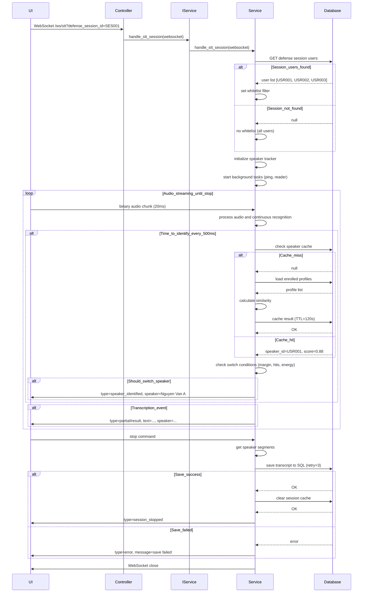
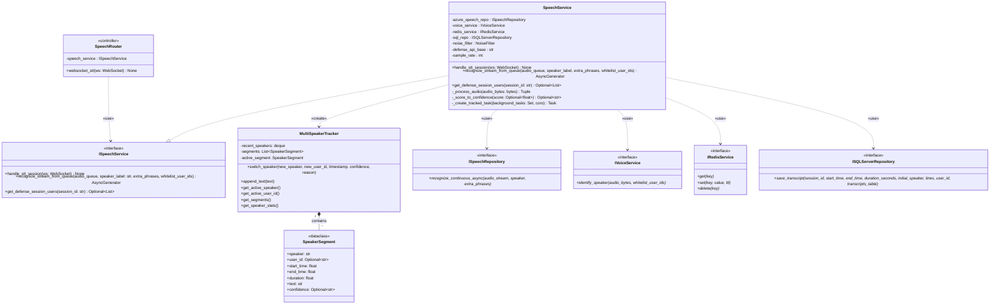

# Streaming Speech-to-Text Feature Documentation

## Overview
Real-time speech-to-text via WebSocket with automatic speaker identification, multi-speaker tracking, and transcript persistence. Uses Azure Speech SDK for continuous recognition and Pyannote/WeSpeaker for speaker identification.

**Endpoint**: `WebSocket /ws/stt`  
**Protocol**: Binary audio streaming (PCM 16kHz mono) + text commands  
**Query Parameters**: `speaker` (initial label), `phrases` (hints), `defense_session_id` (whitelist)

---

## Class Specification

> Architecture Note: STT now uses interfaces (`ISpeechService`, `IVoiceService`, `ISpeechRepository`, `IRedisService`, `ISQLServerRepository`). The WebSocket controller depends only on `ISpeechService`. Concrete classes are resolved via dependency factories in `api/dependencies.py`.

### Table 3.1: SpeechRouter (WebSocket STT Controller) Description Table

| No | Method | Description |
|----|--------|-------------|
| 1  | websocket_stt(ws: WebSocket, speech_service: ISpeechService) → None | This WebSocket endpoint at `/ws/stt` accepts the connection and delegates to ISpeechService.handle_stt_session() for full lifecycle management, handling WebSocketDisconnect exceptions gracefully. |

### Table 3.2: SpeechService (ISpeechService Implementation) Description Table

| No | Method | Description |
|----|--------|-------------|
| 1  | handle_stt_session(ws: WebSocket) → None | This STT session orchestrator parses query parameters, fetches the session whitelist (3 retries), spawns ping and reader background tasks, calls the recognize_stream_from_queue() generator, saves the transcript to SQL Server (3 retries), and clears the Redis cache. |
| 2  | recognize_stream_from_queue(audio_queue: asyncio.Queue, speaker_label: str, extra_phrases: Optional[List[str]] = None, whitelist_user_ids: Optional[List[str]] = None) → AsyncGenerator[Dict[str, Any], None] | This async generator processes audio chunks (20ms frames), performs speaker identification every 500ms (throttled), detects interruptions via energy spikes and acoustic changes, streams Azure recognition events (partial/result/nomatch/error), and appends recognized text to speaker segments. |
| 3  | get_defense_session_users(session_id: str) → Optional[List[str]] | This method delegates to voice_service.get_defense_session_users() to fetch the user whitelist from Defense API, returning None if voice service unavailable or request fails. Used to filter speaker identification to session participants. |
| 4  | _process_audio(audio_bytes: bytes) → Tuple[np.ndarray, Dict[str, float]] | This method runs the audio processing pipeline (noise filter → resample to 16kHz → normalize → adaptive gain → quality analysis → embedding extraction) using a 1.2s-2.5s window for real-time speaker identification. |
| 5  | _score_to_confidence(score: Optional[float]) → Optional[str] | This method maps the similarity score to a confidence level: 'High' (>= threshold+0.12), 'Medium' (>= threshold+0.05), 'Low' (>= threshold), or None if the score is None. |
| 6  | _create_tracked_task(background_tasks: Set[asyncio.Task], coro: Coroutine) → asyncio.Task | This method creates an asyncio task with an automatic cleanup callback to prevent memory leaks, used for ping and reader background tasks. |

### Table 3.3: MultiSpeakerTracker (Speaker Transition Manager) Description Table

| No | Method | Description |
|----|--------|-------------|
| 1  | switch_speaker(new_speaker: str, new_user_id: Optional[str], timestamp: float, confidence: Optional[str], reason: str) → bool | This method switches the active speaker by ending the current segment, starting a new segment, updating the recent_speakers deque (max 4 speakers), and logging the transition, returning True if the speaker was switched. |
| 2  | append_text(text: str) → None | This method appends recognized text to the active speaker segment using space as separator, called when final transcription results arrive. |
| 3  | get_active_speaker() → str | This method returns the current active speaker's name (e.g., "Nguyễn Văn A" or "Khách" for unidentified speakers). |
| 4  | get_active_user_id() → Optional[str] | This method returns the active user's ID or None if the speaker is a guest, used for database persistence. |
| 5  | get_segments() → List[SpeakerSegment] | This method returns all completed speaker segments containing speaker name, user_id, timestamps, duration, text, and confidence, used for transcript persistence. |
| 6  | get_speaker_stats() → Dict[str, Dict[str, Any]] | This method returns per-speaker statistics including total_duration, segment_count, and average_confidence, used for session analytics. |

---

## Sequence Diagram



---

## Class Diagram



---

## Key Features

### WebSocket Protocol

**Connection**: 
```
ws://localhost:8000/ws/stt?defense_session_id=SES001&speaker=Unknown&phrases=API,layer,architecture
```

**Client → Server Messages**:
- Binary audio chunks (PCM 16kHz mono, 20ms frames = 640 bytes)
- Text command: `"stop"` (terminate session gracefully)

**Server → Client Events** (JSON):
```json
// Heartbeat (every 25s)
{"type": "ping", "timestamp": 1732188000}

// Partial transcription (interim results)
{"type": "partial", "text": "Em hỏi về", "speaker": "Nguyễn Văn A"}

// Final transcription
{"type": "result", "text": "Em hỏi về kiến trúc hệ thống", "speaker": "Nguyễn Văn A", "timestamp": 1732188005.123}

// Speaker identified
{"type": "speaker_identified", "speaker": "Nguyễn Văn A", "user_id": "USR001", "confidence": "High", "score": 0.88}

// No speech detected
{"type": "nomatch", "message": "No speech could be recognized"}

// Error
{"type": "error", "message": "Azure Speech error: ..."}

// Session ended
{"type": "session_stopped", "message": "Transcript saved successfully"}
```

### Speaker Identification Strategy

**Throttling**: Every 500ms (2 identifications per second max)

**Audio Window**:
- **Minimum**: 1.2 seconds (IDENTIFY_MIN_SECONDS)
- **Maximum**: 2.5 seconds (IDENTIFY_WINDOW_SECONDS)
- **History**: 4.0 seconds retained for comparison

**Whitelist Filtering**:
- If `defense_session_id` provided → only search session participants
- Improves accuracy (reduces false positives from out-of-session voices)
- Faster (fewer profiles to compare)

**Example**:
```
Session SES001 participants: ["USR001", "USR002", "USR003"]
→ VoiceService.identify_speaker(audio, whitelist=["USR001", "USR002", "USR003"])
→ Ignores all other enrolled users
```

### Multi-Speaker Tracking

**Max Concurrent Speakers**: 4 (recent_speakers deque)

**Speaker Switch Triggers**:
1. **Strong evidence immediate switch**: Score >= threshold + 0.05 AND margin >= required_margin (0.06)
2. **Consecutive hits**: Require 3 hits (2 for groups ≤6) with baseline score and margin ≥ 0.04
3. **Energy spike**: RMS ratio >= 1.5x (interruption detection)
4. **Acoustic change**: ZCR difference >= 0.15 (pitch/timbre shift)

**Speaker Lock Decay**: 
- Dynamic: 3-5 seconds based on confidence (higher confidence = longer lock)
- Margin requirements: 0.06 for normal groups, 0.04 for small groups (≤6 users)
- Hits required: 3 for normal groups, 2 for small groups (≤6 users)

**Segment Structure**:
```python
SpeakerSegment(
    speaker="Nguyễn Văn A",
    user_id="USR001",
    start_time=1732188000.0,
    end_time=1732188005.2,
    duration=5.2,
    text="Em hỏi về kiến trúc hệ thống. API layer dùng để làm gì?",
    confidence="High"
)
```

### Interruption Detection

**Energy Spike**:
```python
current_rms / previous_rms >= 1.5
→ Trigger immediate speaker re-identification
```

**Acoustic Change** (ZCR - Zero Crossing Rate):
```python
abs(current_zcr - previous_zcr) >= 0.15
→ Detect pitch/timbre shift (different speaker)
```

**Purpose**: Catch rapid speaker changes without waiting for 500ms throttle

### Transcript Persistence

**Database**: SQL Server table `Transcripts`

**Schema**:
```sql
CREATE TABLE Transcripts (
    id INT IDENTITY PRIMARY KEY,
    session_id NVARCHAR(50),
    segments_json NVARCHAR(MAX), -- JSON array of SpeakerSegment objects
    created_at DATETIME DEFAULT GETDATE()
)
```

**Retry Policy**: 3 attempts with exponential backoff
- Attempt 1: Immediate
- Attempt 2: Wait 1s
- Attempt 3: Wait 2s
- Attempt 4: Wait 4s (total 3 retries)

**Cache Cleanup**: After save, delete Redis keys:
- `questions:session:{session_id}`
- `partial_transcript:{session_id}`

### Speaker Identification Cache

**Key Format**: `speaker:id:{hash}` where hash is audio fingerprint
- **Hash algorithm**: xxhash64 (16 chars) if available, MD5 fallback
- **Hash strategy**: 
  - Full audio if ≤8KB
  - Stratified sampling (start/middle/end 2KB each) if larger

**TTL**: 120 seconds (2 minutes)

**Purpose**: Avoid re-processing identical audio during identification

**Storage**: Redis (same service as session cache)

### Azure Speech Configuration

**Language**: Vietnamese (`vi-VN`)

**Output Format**: Detailed (includes word-level timestamps)

**Phrase Hints**: 200+ academic/technical/defense terms
```python
DEFAULT_PHRASE_HINTS = [
    "API layer", "kiến trúc hệ thống", "three layer architecture",
    "business logic", "repository pattern", "dependency injection",
    "hội đồng bảo vệ", "luận văn", "nghiên cứu", ...
]
```

**Recognition Mode**: Continuous (doesn't stop after each utterance)

### Performance Characteristics

**Latency**:
- **Partial results**: ~300-500ms (Azure Speech)
- **Final results**: ~1-2s after speech ends
- **Speaker identification**: ~100-300ms (cached: ~2ms)

**Throughput**:
- **Audio input**: 32 kbps (16kHz mono PCM)
- **Events output**: ~5-10 events/second (partial + result + speaker_identified)
- **Max session duration**: Unlimited (until "stop" command)

**Memory**:
- **Audio buffer**: ~40 KB (2.5s window at 16kHz)
- **Speaker tracker**: ~1 KB per segment
- **SBERT model**: 150 MB (shared across sessions)

---

**Last Updated**: November 21, 2025  
**Version**: 1.0
