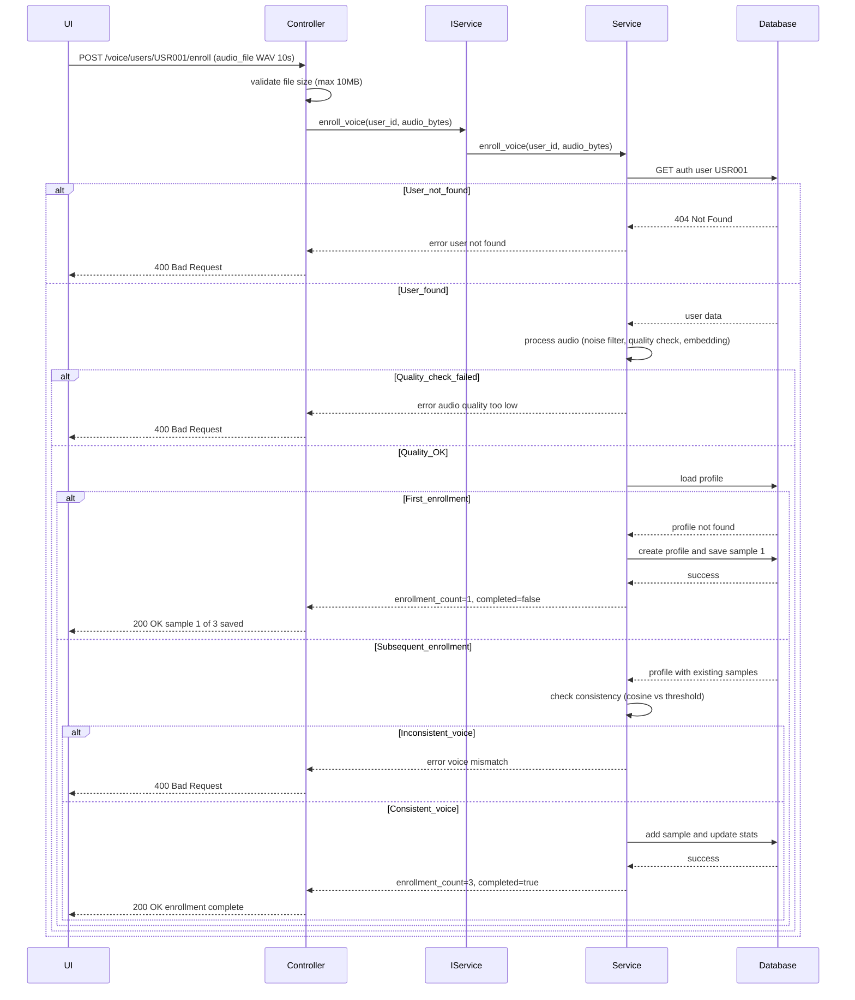

# Voice Enrollment Feature Documentation

## Overview
Voice enrollment allows users to register their voice profile by providing audio samples. The system extracts voice embeddings using Pyannote/WeSpeaker model and stores them for future identification/verification.

**Endpoint**: `POST /voice/users/{user_id}/enroll`  
**Minimum Samples**: 3 samples (each ~3-5 seconds)  
**Audio Format**: WAV/PCM, 16kHz recommended

---

## Class Specification

> Architecture Note (DIP Applied): Controllers depend only on service interfaces (IVoiceService) and services depend on repository interfaces (IVoiceProfileRepository, ISQLServerRepository, IRedisService). Concrete implementations are resolved via FastAPI dependencies in `api/dependencies.py`. This improves testability and decouples business logic from infrastructure.

### Table 1.1: VoiceRouter (Voice Enrollment Controller) Description Table

| No | Method | Description |
|----|--------|-------------|
| 1  | enroll_voice(user_id: str, audio_file: UploadFile, voice_service: IVoiceService) → EnrollmentResponse | `POST /voice/users/{user_id}/enroll` - This endpoint validates the uploaded file (max 10MB), extracts audio bytes, and calls IVoiceService.enroll_voice(), returning enrollment_count and is_complete status. |

### Table 1.2: VoiceService (IVoiceService Implementation) Description Table

| No | Method | Description |
|----|--------|-------------|
| 1  | enroll_voice(user_id: str, audio_bytes: bytes) → Dict[str, Any] | This method validates the user exists, processes audio with quality checks, validates consistency using dynamic threshold (>= 0.63), saves the embedding, and updates statistics when count reaches 3 or more samples. |
| 2  | _process_audio_for_enrollment(audio_bytes: bytes) → Tuple[np.ndarray, Dict[str, float]] | This method runs the audio processing pipeline (noise filter → resample to 16kHz → adaptive gain → quality analysis → embedding extraction) with minimum duration of 10 seconds, returning a 256-dimensional embedding and quality metrics. |
| 3  | _check_enrollment_consistency(embedding: np.ndarray, existing_embeddings: List[np.ndarray], profile: Dict) → None | This method validates cosine similarity against existing samples using a dynamic threshold (starts at 0.63, decays by -0.035 per sample), rejecting enrollments that are too dissimilar (different speaker) or too similar (duplicate recording). |
| 4  | _update_profile_stats(user_id: str, embeddings: List[np.ndarray]) → None | This method computes profile statistics including mean_embedding (L2 normalized), within_var, and sigma, then saves them to the repository (called when enrollment_count >= 3). |
| 5  | get_or_create_profile(user_id: str, name: Optional[str] = None) → Dict[str, Any] | This method loads an existing profile or creates a new one by fetching the user's fullName from Auth API and initializing with schema_version=5 and status='not_enrolled'. |
| 6  | _get_user_from_api(user_id: str) → Optional[Dict[str, Any]] | This method fetches user information from Auth API endpoint `/auth/users/{user_id}` with a 5-second timeout using requests library (synchronous), returning the user dictionary or None if not found. |

---

## Sequence Diagram

---

## Class Diagram

```mermaid
classDiagram
    class VoiceRouter {
        <<controller>>
        -voice_service : IVoiceService
        +enroll_voice(user_id: str, audio_file: UploadFile) EnrollmentResponse
    }

    class IVoiceService {
        <<interface>>
        +enroll_voice(user_id: str, audio_bytes: bytes) Dict
        +get_or_create_profile(user_id: str, name: Optional~str~) Dict
    }

    class VoiceService {
        -profile_repo : IVoiceProfileRepository
        -model_repo : EmbeddingModelRepository
        -noise_filter : NoiseFilter
        -quality_analyzer : AudioQualityAnalyzer
        -thresholds : QualityThresholds
        -auth_api_base : str
        -enrollment_threshold : float
        -enroll_min_similarity : float
        +enroll_voice(user_id: str, audio_bytes: bytes) Dict
        +get_or_create_profile(user_id: str, name: Optional~str~) Dict
        -_process_audio_for_enrollment(audio_bytes: bytes) Tuple
        -_check_enrollment_consistency(embedding, existing_embeddings, profile) None
        -_update_profile_stats(user_id: str, embeddings: List) None
        -_get_user_from_api(user_id: str) Optional~Dict~
    }

    class IVoiceProfileRepository {
        <<interface>>
        +load_profile(user_id: str) Optional~Dict~
        +create_profile(user_id: str, name: str, embedding_dim: int) Dict
        +add_voice_sample(user_id: str, embedding, metrics: Dict) None
        +get_embeddings(user_id: str) List
        +update_mean_embedding(user_id: str, mean_unit, within_var: float, sigma: float) None
        +update_enrollment_status(user_id: str, status: str) None
    }

    class EmbeddingModelRepository {
        +extract_embedding(audio_bytes: bytes) np.ndarray
        +get_embedding_dim() int
        +get_model_tag() str
    }

    class NoiseFilter {
        +reduce_noise(audio_bytes: bytes) bytes
    }

    class AudioQualityAnalyzer {
        +estimate_quality(signal: np.ndarray) Dict
    }

    class QualityThresholds {
        +min_duration: float
        +min_enroll_duration: float
        +rms_floor: float
        +voiced_floor: float
        +snr_floor_db: float
        +clip_ceiling: float
    }

    class EnrollmentResponse {
        <<dataclass>>
        +type: str
        +success: bool
        +user_id: str
        +enrollment_count: int
        +min_required: int
        +is_complete: bool
        +message: str
    }

    VoiceRouter ..> IVoiceService : «use»
    VoiceService ..|> IVoiceService
    VoiceService ..> IVoiceProfileRepository : «use» 
    VoiceService ..> EmbeddingModelRepository : «use»
    VoiceService ..> NoiseFilter : «use»
    VoiceService ..> AudioQualityAnalyzer : «use»
    VoiceService ..> QualityThresholds : «use»
    VoiceRouter ..> EnrollmentResponse : «create»
```

---

## Key Features

### Quality Thresholds (Enrollment)
- **RMS** (energy): >= 0.006
- **SNR** (signal-to-noise): >= 15 dB
- **Voiced ratio** (speech vs silence): >= 20%
- **Clipping ratio**: <= 2%
- **Duration**: >= 10 seconds (stricter than identification's 2s)

### Consistency Validation
- **Base enrollment threshold**: 0.76 (enrollment_threshold)
- **Minimum threshold**: 0.63 (enroll_min_similarity)
- **Dynamic threshold formula**: `max(enroll_min_similarity, enrollment_threshold - decay_per_sample * num_existing_samples)`
- **Decay rate**: -0.035 per sample (allows natural variation as samples increase)
- **Prevents**: Different speaker enrollment (avg_similarity < dynamic_threshold AND min_similarity < threshold - 0.05)
- **Prevents**: Duplicate recording (cosine > 0.98)

### Adaptive Gain Rescue
- **Trigger**: RMS < threshold (quiet speech)
- **Target**: 98th percentile = 0.80
- **Max gain**: 10x amplification
- **Purpose**: Recover valid but quiet recordings

### Profile Statistics (After 3 samples)
- **mean_embedding**: L2-normalized average of all samples
- **within_var**: Variance across samples (consistency measure)
- **sigma**: Standard deviation (used in verification z-score)

### Storage
- **L1 Cache**: Memory LRU (100 profiles)
- **L2 Cache**: Redis (5 min TTL)
- **L3 Storage**: Azure Blob Storage (`{user_id}/profile.json`)
- **Database**: SQL Server (VoiceSamplePath column updated with blob URL)

---

**Last Updated**: November 21, 2025  
**Version**: 1.0
